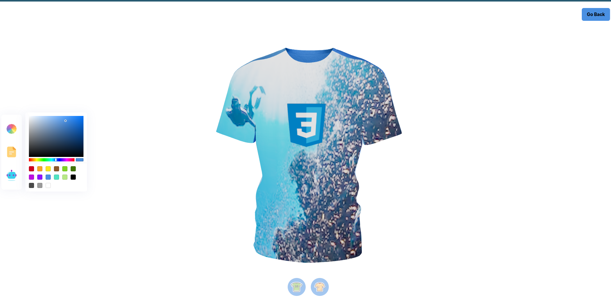

# Shirt Customizer

Let's help you bring your desgin to life. This web app helps to you create your custom tshirt, Add you custom logo and shirt texture. This app was built with Next js, Three js and framer motion

## Live Demo

<https://shirt-customizer-ten.vercel.app/>

## Preview

## Installation

1. Clone the repo and `cd` into it
2. Run `npm install` to install all required dependencies (this will create a /node_modules folder)
3. Then Run `npm run dev` to serve your project to localhost:3000
4. Enjoy
